# Filter-Adapted Spatio-Temporal Sampling With General Distributions

This repo goes with the paper [Importance-Sampled Filter-Adapted Spatio-Temporal Sampling](https://jcgt.org/published/0014/01/08/).

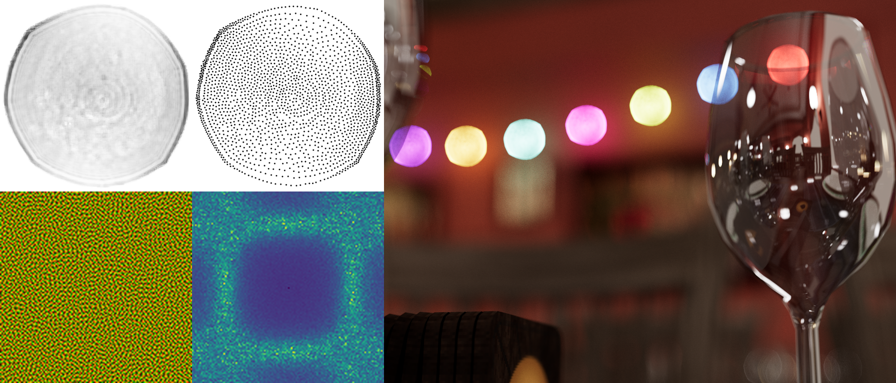

A point distribution image (left top) is made into a representative blue noise point
set (middle top), used to initialize an image for FAST optimization to make a noise texture (left
bottom), meant to be filtered by a 3x3 box filter (middle bottom). A spatiotemporal FAST noise
texture using that distribution is used to sample the lens in a thin lens path tracer on the right.

This image, and the other images in the paper, were rendered using the demo in this repo.

## Other Resources

[25 Minute YouTube Video](https://www.youtube.com/watch?v=aFSkDFcxVVc)

[Slide Deck](https://docs.google.com/presentation/d/1OX9A-lipIfnBn84uRfpsBXXivdK4n1Nt/edit?usp=sharing&ouid=103654468992788649377&rtpof=true&sd=true)

[Published Paper](https://jcgt.org/published/0014/01/08/)

## Running the Demo

There are two ways to run the demo.

1. The `Demo/Gigi/` folder contains the Gigi implementation of the demo `main.gg`.  Gigi is a rapid graphics development and research platform: https://github.com/electronicarts/gigi/.
2. The `Demo/DX12/` folder contains a solution to run the DX12 / C++ code generated by Gigi.

### Replicating Paper results

By default, the demo is set to show a high sample count path traced depth of field / bokeh render, to show that the noise textures converge nicely at high sample counts.

#### Low Sample Count Path Traced Results

To replicate the lower sample count path traced results, turn `Accumulate` off and `AlbedoMode` on. You can also turn off `Animate` if you want a stable image.  Note that you'll have to click the `Reset` button after making changes to settings, to reset the rendering.

From here, you can change the `LensRNGSource` from `LKCP204Blue` to `LKCP204White` to remove the benefits of a FAST optimized noise texture, while still keeping the importance sampling of the pregenerated samples.

From here, turning on `NoImportanceSampling` removes the benefits of the importance sampling, and instead generates uniform white noise random numbers, and uses the PDF to weight samples. This has the effect of also adding in rejection sampling, for the places where the PDF is 0.

The paper used the `LensRNGSource` value of `UniformStarBlue` and `UniformStarWhite`, and the `Exterior` geometry, instead of the default `Interior` geometry.  It also used different camera settings.

In general though, the results should all be similar in that the blue (spatiotemporal optimized) noise texture does the best, the white (non optimized) texture does noticeably less well, and removing importance sampling looks far worse.

#### GatherDOF Results

The GatherDOF post processing depth of field technique requires a rendered scene to apply the technique to.  Normally you would get this through real time rendering means, but in this demo we apply it to a path traced result.

Set `JitterPixels` to `None`, the `DOF` drop down to `Off` and click the `Reset` button, then wait for it to converge a reasonable amount.

Next, set the `DOF` drop down to `PostProcessing`. Turn on the `DoFarFieldFloodFill` and `DoNearFieldFloodFill` GatherDOF settings, and set the `BlurTapCount` to 8. Also set the first value of `KernelSize` to 10 and set `UseNoiseTextures` to false.

You should have a decent looking depth of field and bokeh render. This is the high quality GatherDOF result, using 80 samples per pixel in two passes, and not using the noise textures from our paper.  You can see that it's all done in post processing by switching the `DOF` drop down back and forth between `PostProcessing` and `Off`.

To see this fail at lower sample counts, turn off `DoFarFieldFloodFill` and `DoNearFieldFloodFill` and set `BlurTapCount` to 4.  The sampling artifacts should become very noticeable.  This is 16 samples per pixel in a single pass, still not using the noise textures from our paper.

To see the results using our noise textures, set `LensRNGSource` to `UniformHexagonBlue` and turn on `UseNoiseTextures` in `GatherDOF`. At this point it should look temporally noisy.  Under `TemporalAccumulation` set `Alpha` to 0.1 and set `Enabled` to true. The noise should stabalize pretty nicely, showing comparable results using 16 samples of our noise textures in a single pass, compared to 80 samples without our noise textures in two passes.

Setting `LensRNGSource` to `UniformHexagonWhite` should show a degradation in quality. To see it more clearly, you can turn off temporal accumulation, and under `GatherDOF` turn off `AnimateNoiseTextures`. That will let you compare a single unfiltered frame of blue (spatiotemporal optimized) versus white (not optimized). White will be much rougher looking overall, where blue is smoother looking and finer details can be made out.  When animated and temporally accumulated, blue should be more temporally stable as well.

## Pre-Generated Noise Textures

A few pre-generated noise textures are available in the `Demo/Gigi/Assets/NoiseTextures/` folder.

Each is a set of 32 files that are 128x128, making a 2d array texture that is 128x128x32.  The textures are optimized to give rendering error as blue noise over space, and to converge more quickly under an exponential moving average, like is found in typical TAA implementations.

The textures are meant to be used as the source of per pixel random numbers, where you sample at `(pixelX, pixelY, sampleIndex) % (128, 128, 32)` to get a vec2 value.  To get more than 32 samples, a cycle index is calculated by dividing sampleIndex by 32, and that cycle index is used to offset the noise texture globally.  The 2D offset is calculated by putting the cycle index into a stateless 2D shuffle (bijection) which uses the golden ratio and the Hilbert curve to have the offset visit each pixel in the noise texture in a low discrepancy pattern before repeating, causing each pixel to have a sampling sequence that is 128\*128\*32 = 524,288 samples long.  You can read more about this low discrepancy shuffle at https://blog.demofox.org/2024/10/04/a-two-dimensional-low-discrepancy-shuffle-iterator-random-access-inversion/, and it is also implemented in the demo.

The textures ending in `.0.png` can be ignored. They are unoptimized white noise textures needed for experimental results in the paper.

Please see our paper for more details on usage, and see the FAST noise documentation for more information on FAST noise [https://github.com/electronicarts/fastnoise/blob/main/FastNoiseDesign.md](https://github.com/electronicarts/fastnoise/blob/main/FastNoiseDesign.md).

| Distribution | Image 0 | DFT | Folder |
| ------------ | ------- | --- | -------- |
| 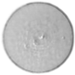 | 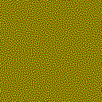 | 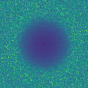 | [Lens_kernel_compositingpro.006](Demo/Gigi/Assets/NoiseTextures/Lens_kernel_compositingpro.006/) |
| 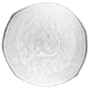 | 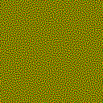 | 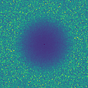 | [Lens_kernel_compositingpro.204](Demo/Gigi/Assets/NoiseTextures/Lens_kernel_compositingpro.204/) |
|  | 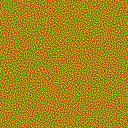 | 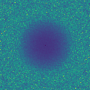 | [NonUniformStar](Demo/Gigi/Assets/NoiseTextures/NonUniformStar/) |
|  | 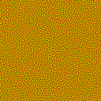 | 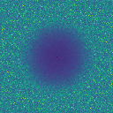 | [NonUniformStar2](Demo/Gigi/Assets/NoiseTextures/NonUniformStar2/) |
| 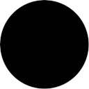 | 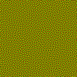 | 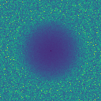 | [UniformCircle](Demo/Gigi/Assets/NoiseTextures/UniformCircle/) |
| 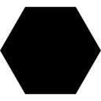 | 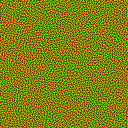 | 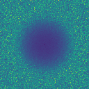 | [UniformHexagon](Demo/Gigi/Assets/NoiseTextures/UniformHexagon/) |
| 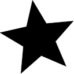 | 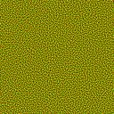 | 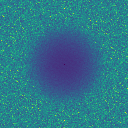 | [UniformStar](Demo/Gigi/Assets/NoiseTextures/UniformStar/) |
| 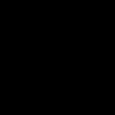 | 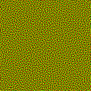 | 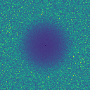 | [FAST](Demo/Gigi/Assets/NoiseTextures/FAST/) |

## Generating Noise Textures

Generating FAST noise textures with general distributions involves three steps:

1. Turn a distribution into a blue noise point set.
2. Convert the point set into a binary file of float4 values.
3. Run the FAST noise generation utility, using the binary file as an initial state before optimization.

### 1. Turn a distribution into a blue noise point set.

For generating 2D blue noise point sets following a specific distribute, we use a greyscale image to describe the desired point densitities.

We pass that image into the utility that goes with [Serial Gaussian Blue Noise Stippling](https://diglib.eg.org/items/d70b33ed-2a29-4e70-aa14-97088b2728d1), which can be found in `Utils/agbn`.

The `_MakeSamples.bat` file shows how to convert from pgm files (a text format) into text files which contain the point sets.

We generate each of the 32 Z slices independently, to ensure a good distribution of points for each Z slice.

### 2. Convert the point set into a binary file of float4 values.

We made a utility for this which can be found in `Utils/Gbn2Bin`.

As we are only dealing with two dimensional points, but need to write out float4s for the FAST utility, we write 0 for z and 1 for w.  Z and w become the blue and alpha channel of the FAST noise textures respectively.

### 3. Run the FAST noise generation utility, using the binary file as an initial state before optimization.

We use the standard [FAST utility](https://github.com/electronicarts/fastnoise) to generate noise textures, using the binary format as an initial state before optimization.

To specify a starting state for FAST, you use the `-init <filename>` command line option. For example:

`FastNoise.exe Vector2 Uniform gauss 1.0 exponential 0.1 0.1 separate 0.5 128 128 32 NonUniformStar -split -init NonUniformStar.bin -progress 1`

Your binary file must have the same number of data points as there are pixels in the image you are generating.

### Notes

The pregenerated files were made to be blue noise spatially, optimized for EMA temporally, and contain 2D points per pixel.

The techniques described allow you to use general distributions while using the full range of FAST capabilities:
* Optimize for different spatial filters.
* Optimize for different temporal filters.
* Store points in different spaces, such as on a sphere, on a mesh, or in a mesh.

We showcased depth of field and bokeh as a usage case for this work, but are looking forward to people using the general idea in other situations as well.

Another example made after the paper was published is use in area lights, with results shown below.  The demo for this is available in the [Gigi](https://github.com/electronicarts/gigi/) browser, and is named "Blue Noise Area Lights".

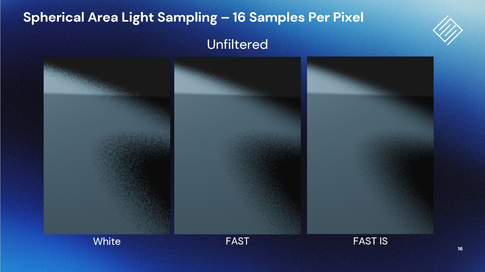

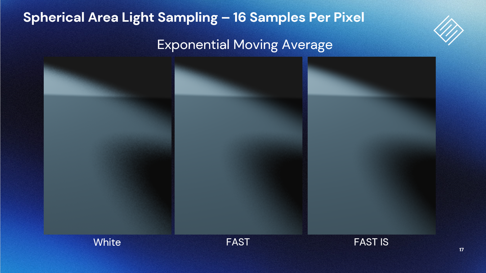

## Authors

 
<b>Search for Extraordinary Experiences Division (SEED) - Electronic Arts   http://seed.ea.com</b> 
We are a cross-disciplinary team within EA Worldwide Studios. 
Our mission is to explore, build and help define the future of interactive entertainment.  
Code and paper by Alan Wolfe, William Donnelly, and Henrik Halén.

## Contributing

Before you can contribute, EA must have a Contributor License Agreement (CLA) on file that has been signed by each contributor.
You can sign here: http://bit.ly/electronic-arts-cla
